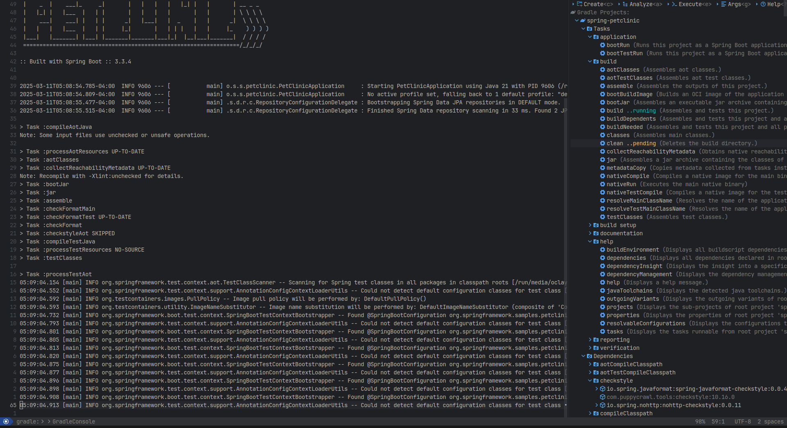
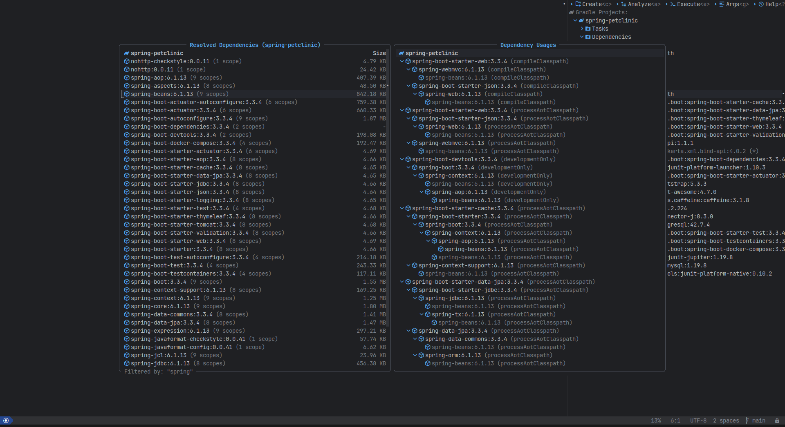
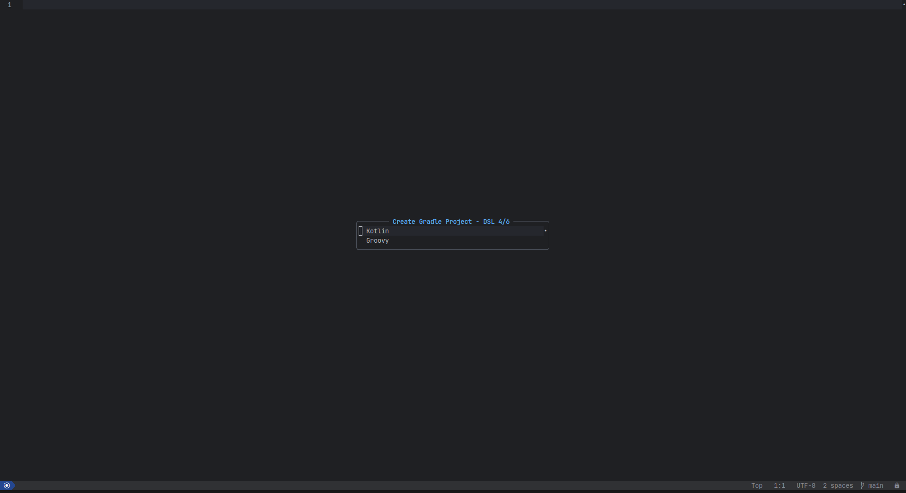
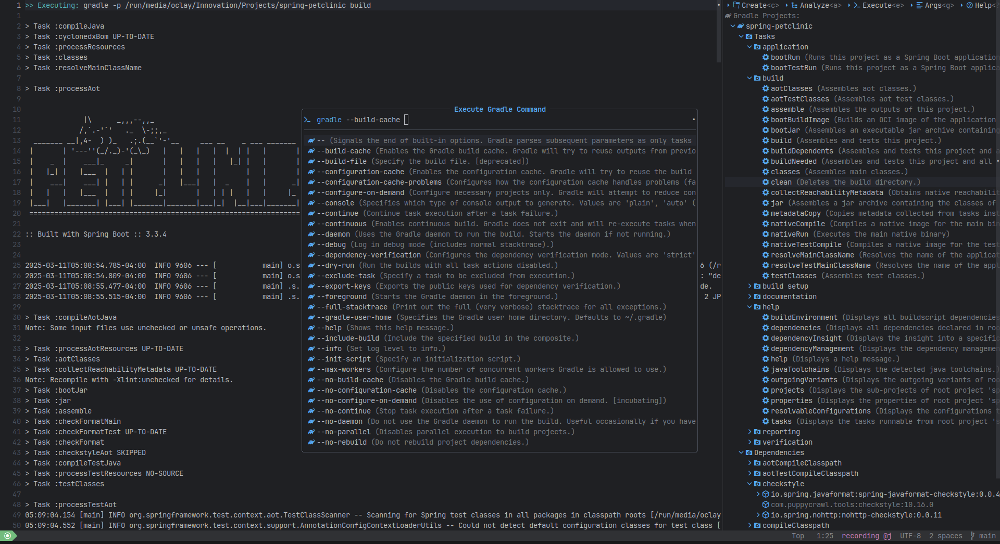
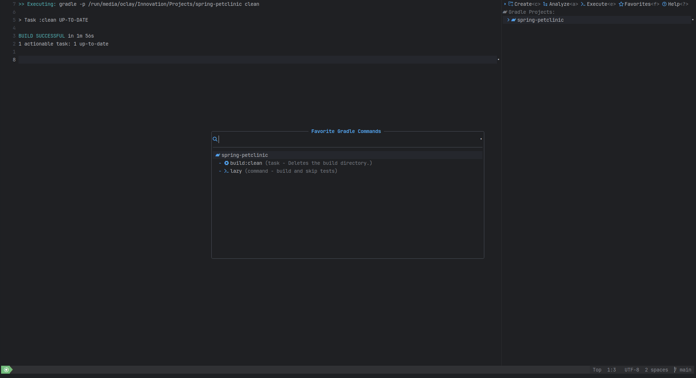
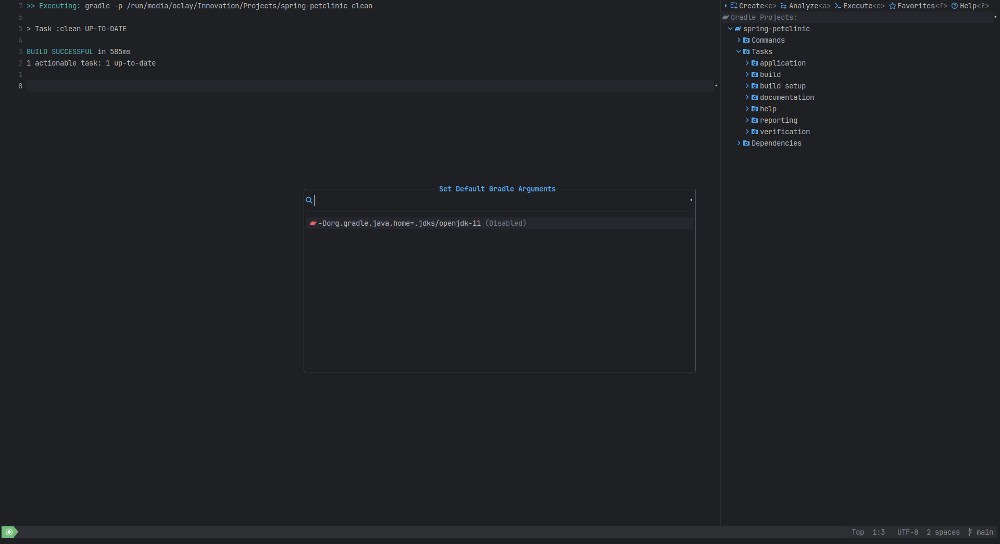

<br/>
<div align="center">
  <a  href="https://github.com/oclay1st/gradle.nvim">
    
  </a>
</div>

**gradle.nvim** is a plugin to use Gradle (Java) in Neovim.

<table>
  <tr>
    <td> </td>
    <td></td>
   </tr>
   <tr>
    <td></td>
    <td></td>
  </tr>
  <tr>
    <td></td>
    <td></td>
  </tr>
</table>

## ✨ Features

- Create projects from scratch
- Execute tasks and custom commands
- List dependencies and their relationship
- Analyze dependencies usages, conflicts and duplications
- Enqueue multiple commands executions
- Show the output of the commands executions
- Cache tasks, dependencies and command options
- List, add and remove favorite commands
- Set default arguments for executions

## ⚡️ Requirements

- Neovim 0.10 or superior

## 📦 Installation

### lazy.nvim

```lua
{
   "oclay1st/gradle.nvim",
   cmd = { "Gradle", "GradleExec", "GradleInit", "GradleFavorites" },
   dependencies = {
      "nvim-lua/plenary.nvim",
      "MunifTanjim/nui.nvim",
      -- optional which-key group registration
      {
        'folke/which-key.nvim',
        opts = { spec = { { mode = { 'n', 'v' }, { '<leader>G', group = 'Gradle', icon = { icon = '', color = 'blue' } } } } },
      },
   },
   opts = {}, -- options, see default configuration
   keys = {
      { '<leader>Gg', '<cmd>Gradle<cr>', desc = 'Gradle Projects' },
      { '<leader>Gf', '<cmd>GradleFavorites<cr>', desc = 'Gradle Favorite Commands' }
    },
}
```

## ⚙️  Default configuration

```lua
{
  gradle_executable = "gradle", -- Example: gradle, ./gradlew or a path to Gradle executable
  project_scanner_depth = 5
  console = {
    show_command_execution = true,
    show_task_execution = true,
    show_dependencies_load_execution = false,
    show_tasks_load_execution = false,
    show_project_create_execution = false,
    clean_before_execution = true,
  },
  cache = {
    enable_tasks_cache = true,
    enable_dependencies_cache = true,
    enable_help_options_cache = true,
  },
  projects_view = {
    custom_commands = {
    -- Example:
    -- {
    --   name = "lazy",
    --   cmd_args = { "build" },
    --   description = "build the project",
    -- }
    },
    position = 'right',
    size = 65,
  },
  dependencies_view = {
    size = { -- see the nui doc for details about size
      width = '70%',
      height = '80%',
    },
    resolved_dependencies_win = {
      border = { style = 'rounded' },
    },
    dependency_usages_win = {
      border = { style = 'rounded' },
    },
    filter_win = {
      border = { style = 'rounded' },
    },
    dependency_details_win = {
      size = {
        width = '80%',
        height = '6',
      },
      border = { style = 'rounded' },
    }
  },
  initializer_view = {
    project_name_win = {
      border = { style = 'rounded' },
    },
    project_package_win = {
      default_value = '',
      border = { style = 'rounded' },
    },
    java_version_win = {
      border = { style = 'rounded' },
    },
    dsl_win = {
      border = { style = 'rounded' },
    },
    test_framework_win = {
      border = { style = 'rounded' },
    },
    workspaces_win = {
      options = {
        { name = 'HOME', path = vim.loop.os_homedir() },
        { name = 'CURRENT_DIR', path = vim.fn.getcwd() },
      },
      border = { style = 'rounded' },
    },
  },
  execution_view = {
    size = {
      width = '40%',
      height = '60%',
    },
    input_win = {
      border = {
        style = { '╭', '─', '╮', '│', '│', '─', '│', '│' },
      },
    },
    options_win = {
      border = {
        style = { '', '', '', '│', '╯', '─', '╰', '│' },
      },
    },
  },
  help_view = {
    size = {
      width = '80%',
      height = '34%',
    },
    border = { style = 'rounded' },
  },
  default_arguments_view = {
    arguments = {
    --Example:
    -- {
    --    enabled = false, --if the argument should be enabled by default
    --    arg="-Dorg.gradle.java.home", -- the argument
    --    value=".jdks/openjdk-11" -- the value of the argument
    -- }
    },
    size = {
      width = '40%',
      height = '60%',
    },
    input_win = {
      border = {
        style = { '╭', '─', '╮', '│', '│', '─', '│', '│' },
      },
    },
    options_win = {
      border = {
        style = { '', '', '', '│', '╯', '─', '╰', '│' },
      },
    },
  },
  icons = {
    package = '',
    new = '',
    tree = '󰙅',
    expanded = ' ',
    collapsed = ' ',
    gradle = '',
    project = '',
    tool_folder = '',
    tool = '',
    command = '',
    help = '󰘥',
    package_dependents = '',
    package_dependencies = '',
    warning = '',
    entry = ' ',
    search = '',
    argument = '',
  },
}
```

## 🎨 Highlight Groups

<!-- colors:start -->

| Highlight Group | Default Group | Description |
| --- | --- | --- |
| **GradleNormal** | ***Normal*** | Normal text |
| **GradleNormalNC** | ***NormalNC*** | Normal text on non current window |
| **GradleCursorLine** | ***CursorLine*** | Cursor line text |
| **GradleSpecial** | ***Special*** | Special text |
| **GradleComment** | ***Comment*** | Comment text |
| **GradleTitle** | ***Title*** | Title text |
| **GradleError** | ***DiagnosticError*** | Error text |
| **GradleWarn** | ***DiagnosticWarn*** | Warning text |
| **GradleInfo** | ***DiagnosticInfo*** | Info text |

<!-- colors:end -->
