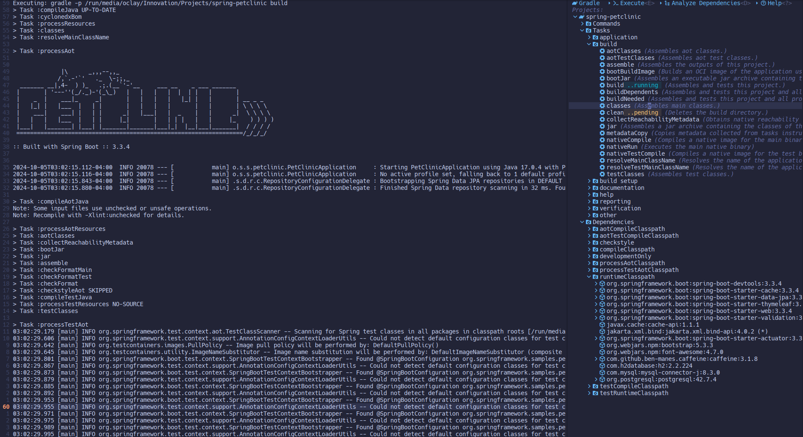

<br/>
<div align="center">
  <a  href="https://github.com/oclay1st/gradle.nvim">
    
  </a>
</div>

**gradle.nvim** is a plugin to use Gradle (Java) in Neovim.

<div>
  
</div>

## 🔥 Status
This plugin is under **Development**.

## ✨ Features

- Create projects from scratch
- Execute tasks and custom commands
- List dependencies and their relationship
- Analyze dependencies usages, conflicts and duplications
- Enqueue multiple commands executions
- Show the output of the commands executions

## ⚡️ Requirements

- Neovim 0.10 or superior

## 📦 Installation

### lazy.nvim

```lua
{
   "oclay1st/gradle.nvim",
   cmd = { "Gradle", "GradleExec", "GradleInit" },
   dependencies = {
      "nvim-lua/plenary.nvim",
      "MunifTanjim/nui.nvim",
   },
   opts = {}, -- options, see default configuration
   keys = {
      {
        "<Leader>G",
        function()
          require("gradle").toggle_projects_view()
        end,
        desc = "Gradle",
      },
   }
}
```

## ⚙️  Default configuration

```lua
{
  projects_view = {
    position = "right", -- Example: right or left
    size = 66,
  },
  initializer_view = {
    default_package = '', -- Example: io.github.username
    workspaces = {
      { name = "HOME", path = vim.loop.os_homedir() },
      { name = "CURRENT_DIR", path = vim.fn.getcwd() },
    },
  },
  console = {
    show_command_execution = true,
    show_task_execution = true,
    show_dependencies_load_execution = false,
    show_tasks_load_execution = false,
    show_project_create_execution = false,
    clean_before_execution = true
  },
  gradle_executable = "gradle", -- Example: gradle, ./gradlew or a path to Gradle executable
  custom_commands = {
    -- Example: 
    -- {
    --   name = "lazy",
    --   cmd_args = { "build" },
    --   description = "build the project",
    -- }
  }, 
  project_scanner_depth = 5
}
```
